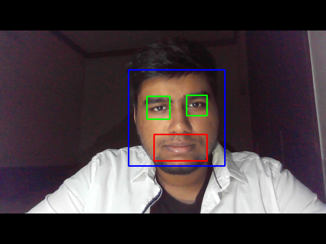
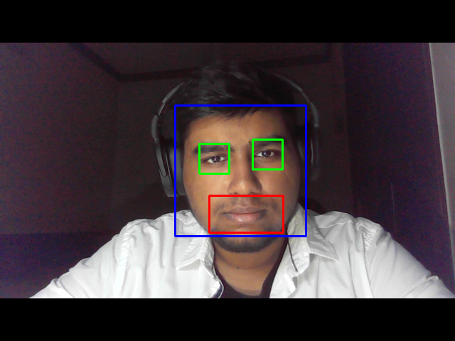

# Real time face detection using haar cascades - OpenCV

The image frame is taken from the webcam video and is converted to gray scale. 
Then using the haar cascades, face, eyes, and smile is detected.

